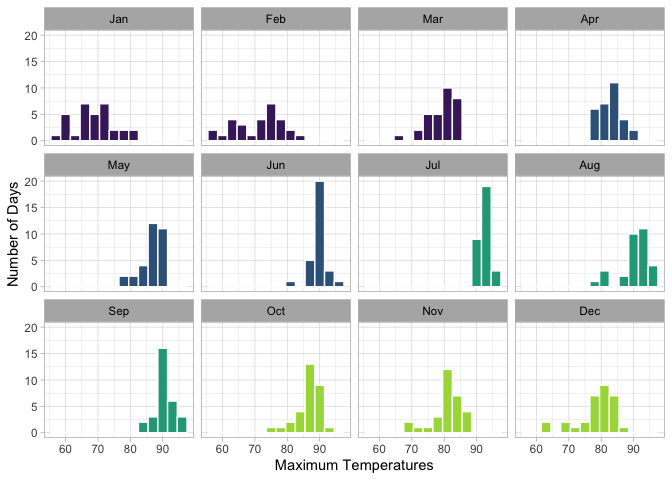
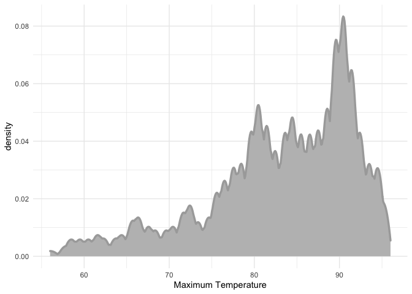
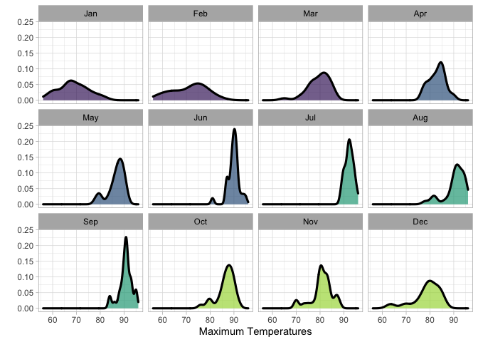
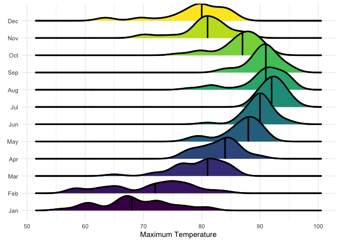
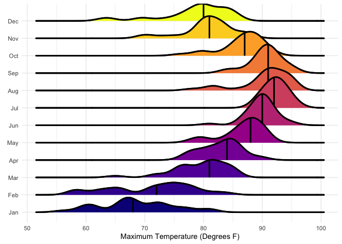

# Data Visualization Project 03


In this exercise you will explore methods to visualize text data and practice how to recreate charts that show the distributions of a continuous variable. 


## Part 1: Density Plots

Using the dataset obtained from FSU's [Florida Climate Center](https://climatecenter.fsu.edu/climate-data-access-tools/downloadable-data), for a station at Tampa International Airport (TPA) from 2016 to 2017, attempt to recreate the charts shown below


```r
library(tidyverse)
weather_tpa <- read_csv("https://github.com/reisanar/datasets/raw/master/tpa_weather_16_17.csv")
# random sample 
sample_n(weather_tpa, 4)
```

```
## # A tibble: 4 x 6
##    year month   day precipitation max_temp min_temp
##   <dbl> <dbl> <dbl>         <dbl>    <dbl>    <dbl>
## 1  2016    10    12          0          87       69
## 2  2016     6     9          0.1        87       78
## 3  2016     6     1          0.02       91       77
## 4  2016     7    25          0          90       75
```

See https://www.reisanar.com/slides/relationships-models#10 for a reminder on how to use this dataset with the `lubridate` package for dates and times.


(a) Recreate the plot below:


Hint: the option `binwidth = 3` was used with the `geom_histogram()` function.


```r
weather_tpa %>% 
  mutate(month_name = lubridate::month(month, label = T)) %>% 
  ggplot(aes(x = max_temp, fill = month)) +
  geom_histogram(binwidth = 3, color = "white") + 
  scale_fill_viridis_b()+
  facet_wrap(~month_name) +
  theme_light()+
  theme(legend.position = "none", strip.text = element_text(color = "black")) +
  labs(x = "Maximum Temperatures",
       y = "Number of Days")
```

<!-- -->


(b) Recreate the plot below:


Hint: check the `kernel` parameter of the `geom_density()` function, and use `bw = 0.5`.


```r
weather_tpa %>% 
  ggplot(aes(max_temp)) + 
  geom_density(bw = 0.5, kernel = "epanechnikov",
               color = "dark grey", fill = "grey",
               size = 1.2) +
  theme_minimal() +
  labs(x = "Maximum Temperature")
```

<!-- -->


(c) Recreate the chart below:


Hint: default options for `geom_density()` were used. 

```r
weather_tpa %>% 
  mutate(month_name = lubridate::month(month, label = T)) %>% 
  ggplot(aes(x = max_temp, fill = month)) +
  geom_density(color = "black", alpha = 0.7, size = 1.1) + 
  scale_fill_viridis_b() +
  facet_wrap(~month_name) +
  theme_light()+
  theme(legend.position = "none", strip.text = element_text(color = "black")) +
  labs(x = "Maximum Temperatures",
       y = "")
```

<!-- -->


(d) Recreate the chart below:


Hint: default options for `geom_density()` were used. 


```r
library(ggridges)
weather_tpa %>% 
  mutate(month_name = lubridate::month(month, label = T)) %>% 
  ggplot(aes(x = max_temp, y = month_name, fill = month_name)) + 
  geom_density_ridges(size = 1.1) +
  stat_density_ridges(quantile_lines = TRUE, quantiles = 0.5, size = 1.1) + 
  scale_fill_manual(values = viridis::viridis(n = 12)) +
  theme_minimal() +
  theme(legend.position = "None") + 
  labs(x = "Maximum Temperature", y = element_blank())
```

```
## Picking joint bandwidth of 1.49
## Picking joint bandwidth of 1.49
```

<!-- -->

(e) Recreate the plot below:


Hint: use the`ggridges` package, and the `geom_density_ridges()` function paying close attention to the `quantile_lines` and `quantiles` parameters.

(f) Recreate the chart below:


Hint: this uses the `plasma` option (color scale) for the _viridis_ palette.

```r
library(ggridges)
weather_tpa %>% 
  mutate(month_name = lubridate::month(month, label = T)) %>% 
  ggplot(aes(x = max_temp, y = month_name, fill = month_name)) + 
  geom_density_ridges(size = 1.1) +
  stat_density_ridges(quantile_lines = TRUE, quantiles = 0.5, size = 1.1) + 
  scale_fill_manual(values = viridis::plasma(n = 12)) +
  theme_minimal() +
  theme(legend.position = "None") + 
  labs(x = "Maximum Temperature (Degrees F)", y = element_blank())
```

```
## Picking joint bandwidth of 1.49
## Picking joint bandwidth of 1.49
```

<!-- -->


## Part 2: Visualizing Text Data

Review the set of slides (and additional resources linked in it) for visualizing text data: https://www.reisanar.com/slides/text-viz#1

Choose any dataset with text data, and create at least one visualization with it. For example, you can create a frequency count of most used bigrams, a sentiment analysis of the text data, a network visualization of terms commonly used together, and/or a visualization of a topic modeling approach to the problem of identifying words/documents associated to different topics in the text data you decide to use. 

Make sure to include a copy of the dataset in the `data/` folder, and reference your sources if different from the ones listed below:

- [Billboard Top 100 Lyrics](https://github.com/reisanar/datasets/blob/master/BB_top100_2015.csv)

- [RateMyProfessors comments](https://github.com/reisanar/datasets/blob/master/rmp_wit_comments.csv)

- [FL Poly News 2020](https://github.com/reisanar/datasets/blob/master/poly_news_FL20.csv)

- [FL Poly News 2019](https://github.com/reisanar/datasets/blob/master/poly_news_FL19.csv)

(to get the "raw" data from any of the links listed above, simply click on the `raw` button of the GitHub page and copy the URL to be able to read it in your computer using the `read_csv()` function)
